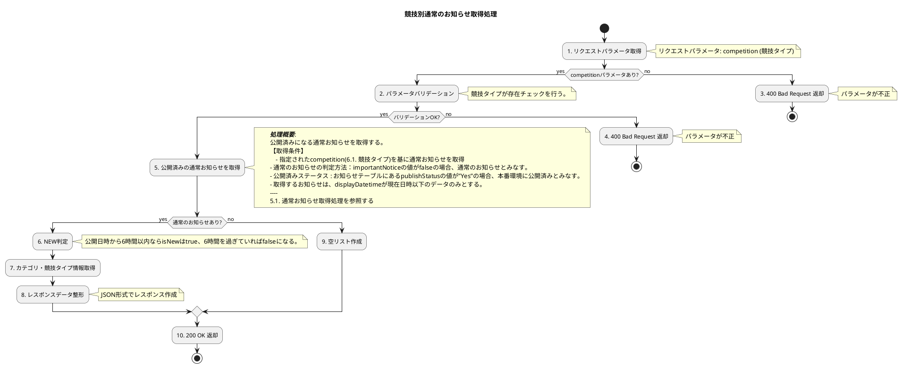

# API仕様書_AMGBIO508_【Liferay】通常お知らせ取得業務API

## 1. 表紙

<h1 style="text-align:center;">

    ネット投票システム(RAISE)／API仕様書
    通常お知らせ取得業務API

</h1>

<h3 style="text-align:center;">

    2026年05月29日
    第 01.00 版
    オッズ・パーク株式会社

</h3>

## 2. 変更履歴

| 版数  | 変更日         | 変更ID | 変更箇所 | 変更内容           | 更新者      | 承認日付       | 承認者         |
| ----- | -------------- | :----- | -------- | ------------------ | ----------- | -------------- | -------------- |
| 00.01 | 2026年03月05日 | -      | -        | 新規作成           | FPT DuyDV36 | -              | -              |
| 00.02 | 2026年03月09日 | -      | -        | 内部レビュー対応   | FPT DuyDV36 | 2026年03月09日 | FPT DatNT201   |
| 00.03 | 2026年03月11日 | -      | -        | SAレビュー指摘対応 | FPT DuyDV36 | 2026年03月11日 | FPT Mina Iseki |
| 01.00 | 2026年05月29日 | - | - | ベースライン版発行 | FPT HaNS5 | 2026年05月29日 | OP 川和田 |

## 3. インプット一覧

| ドキュメント | 詳細                 | ID/No                             | 名称                                                                                 |
| ------------ | -------------------- | --------------------------------- | ------------------------------------------------------------------------------------ |
| 要件定義書   | 業務フロー           | A03-050101-01                     | A03-050101-01_情報提供（CMS）_お知らせ情報登録_v01.01.xlsx                           |
| 要件定義書   | ビジネスルール       | 8-13.お知らせ                     | OP NEXTシステム_ビジネスルール_v02.05.xlsx                                           |
| 要件定義書   | 業務処理定義書       | A03-010_お知らせ記事登録・TOP表示 | A03_情報提供_業務処理定義書_v02.02.xlsx                                              |
| 要件定義書   | システム化業務一覧   | A03-031                           | システム化業務一覧_v02.08.xlsx                                                       |
| 要件定義書   | システム化業務説明書 | A03-031                           | システム化業務説明書_情報提供_A03-031_v01.01.xlsx                                    |
| その他       | 業務開発対象一覧     | -                                 | 業務開発対象一覧_お知らせ関連.xlsx                                                   |
| 新要件一覧   | -                    | No.291                            | 別紙090_新要件一覧.xlsx                                                              |
| 現行サイト   | -                    | -                                 | https://www.oddspark.com/info                                                        |
| モックアップ | -                    | -                                 | https://mockup.opnextlab.click/proto-pages/info/cm_ann_list                          |
| バックログ   | -                    | NEXTDEV-7981                      | 【情報系ーお知らせ関連】【課題】お知らせ関連のソリューション変更内容についてのご報告 |
| バックログ   | -                    | NEXTDEV-4283                      | 「通常お知らせ」の設定の「アプリ」の選択・制御の仕様検討                             |
| バックログ   | -                    | NEXTDEV-4284                      | お知らせ関連の追加依頼のロジックを検討・モック確認・資料更新                         |

## 4. API処理仕様

| APIID     | API 名                  |
| :-------- | :---------------------- |
| AMGBIO508 | 通常お知らせ取得業務API |

### 4.1. API概要

#### 4.1.1. 目的

各TOP画面（総合・競馬・競輪・オートレース・LOTO）に表示する最新の3件の通常のお知らせを取得する。本番環境公開済みの通常お知らせのみを対象とする。

#### 4.1.2. 機能概要

* 公開された最新の3件の通常のお知らせを取得する。limitパラメータで取得件数を変更できる。
* 通常のお知らせの判定方法：importantNoticeの値がfalseの場合、通常のお知らせとみなす。
* 通常のお知らせには「公開日」「Newフラグ」「競技タイプ」「カテゴリ」「タイトル」を含む。
* Newフラグ判定：通常のお知らせごとにisNewフラグがあり、現在時刻が公開日時から6時間以内ならisNewはtrue、6時間を過ぎていればfalseになる。

#### 4.1.3. 利用シーン

**I競技タイプを条件に通常お知らせを取得する業務API**

* 目的: 最新の通常のお知らせを3件取得する。
* 特徴: 競技タイプによる通常のお知らせのフィルタリングを実施する。
* 使用例:
    - **競馬TOP画面**: `competition=1:競馬` を指定 → 競馬関連の通常のお知らせのみ取得する。
    - **競輪TOP画面**: `competition=2:競輪` を指定 → 競輪関連の通常のお知らせのみ取得する。
    - **オートレースTOP画面**: `competition=3: オートレース` を指定 → オートレース関連の通常のお知らせを取得する。
    - **LOTOTOPページ**: `competition=4: LOTO` を指定 → LOTO関連の通常のお知らせを取得する。
    - **総合TOP画面**: `competition=5:総合` を指定 → 総合関連の通常のお知らせのみ取得する。

#### 4.1.4. データ構造

* **categories (カテゴリ)**: 通常のお知らせの種類を分類（関連情報、サービス、その他）。
* **competitions (競技タイプ)**: 通常のお知らせを分類（総合、競馬、競輪、オートレース、LOTO）。
    - **重要**: このAPIでは `competition` パラメータで指定された競技のみに絞り込む。
* **displayDatetime(公開日時)**: 通常のお知らせの公開日時。
* **noticeTitle(タイトル)**: 通常のお知らせのタイトル。

#### 4.1.5. 制約や注意点

* **固定件数**: 取得件数は最大3件（ページネーションなし）。
* **公開ステータス**: **公開済み**の通常のお知らせのみ対象。
* **Newフラグ判定**: バックエンドで自動計算され、フロントエンドは `isNew` フィールドを参照するだけで良い。
* **必須パラメータ**: `competition` パラメータは必須。未指定の場合は 400 Bad Request を返却する。
* **競技絞り込み**: 指定された競技タイプを持つ通常お知らせのみを取得する。

### 4.2. エンドポイント

| HTTPメソッド | リソースパス                                      |
| :----------- | :------------------------------------------------ |
| GET          | `/o/headless-api/v1.0/cms-regular-notification` |

### 4.3. インプットパラメータ

| NO | 項目名     | 必須 | 備考                                                                                                                                                                  |
| -- | :--------- | :--: | :-------------------------------------------------------------------------------------------------------------------------------------------------------------------- |
| 1  | 競技タイプ |  ○  | 種別：クエリストリング
データ型：Interger
入力範囲：1～5
項目ID（仮）：competition
空文字・複数指定不可
例：1→競馬　※6.1. 競技タイプを参照 |
| 2  | 取得件数   |  △  | 種別：クエリストリング
データ型：Interger
デフォルト値：3
項目ID（仮）：limit
※本APIはお知らせを最大3件返するが、limitで取得件数を変更できる。   |

**バリデーション:**

| No | 項目名     | チェック内容         | メッセージID | エラーメッセージ                     | HTTPステータス |
| -- | ---------- | -------------------- | ------------ | ------------------------------------ | -------------- |
| 1  | 競技タイプ | 未指定               | MDBCME0001   | 競技タイプを入力してください。       | 400            |
| 2  | 競技タイプ | 存在しない競技タイプ | MDBCME0014   | 正しい競技タイプを入力してください。 | 400            |

### 4.4. アウトプットパラメータ

| NO    | 項目名                                             | 必須 | 備考                                                                                                                                            |
| ----- | -------------------------------------------------- | :--: | ----------------------------------------------------------------------------------------------------------------------------------------------- |
| 1     | お知らせリスト                                     |  〇  | 通常のお知らせリスト
データ型：Array（配列）
項目ID（仮）：items
最大件数：3件                                                   |
| 1.1   | &nbsp;&nbsp;&nbsp;お知らせID                       |  〇  | 通常のお知らせID
データ型：Long
項目ID（仮）：id                                                                                      |
| 1.2   | &nbsp;&nbsp;&nbsp;カテゴリリスト                   |  〇  | カテゴリリスト
データ型：Array（配列）
項目ID（仮）：categories                                                                       |
| 1.2.1 | &nbsp;&nbsp;&nbsp;&nbsp;&nbsp;&nbsp;カテゴリキー   |  〇  | カテゴリキー
データ型：Long
項目ID（仮）：categories.key                                                                              |
| 1.2.2 | &nbsp;&nbsp;&nbsp;&nbsp;&nbsp;&nbsp;カテゴリ名     |  〇  | カテゴリ名
データ型：varchar(64)
最大文字数：64文字
項目ID（仮）：categories.name                                                |
| 1.3   | &nbsp;&nbsp;&nbsp;競技タイプリスト                 |  〇  | 競技タイプリスト (Array)
データ型：Array（配列）
項目ID（仮）：competitions
対象競技タイプに一致する競技タイプ情報のみ返却する。 |
| 1.3.1 | &nbsp;&nbsp;&nbsp;&nbsp;&nbsp;&nbsp;競技タイプキー |  〇  | 競技タイプキー
項目ID（仮）：competitions.key
データ型：Long                                                                          |
| 1.3.2 | &nbsp;&nbsp;&nbsp;&nbsp;&nbsp;&nbsp;競技タイプ名   |  〇  | 競技タイプ名
データ型：varchar(64)
項目ID（仮）：competitions.name
最大文字数：64文字                                            |
| 1.4   | &nbsp;&nbsp;&nbsp;公開日時                         |  〇  | 通常のお知らせの公開日時
データ型：Datetime
項目ID（仮）：displayDatetime
フォーマット：YYYY-MM-DD HH:MM:SS                      |
| 1.5   | &nbsp;&nbsp;&nbsp;お知らせタイトル               |  〇  | 通常のお知らせタイトル
データ型：varchar(128)
最大文字数：128文字
項目ID（仮）：noticeTitle                                    |
| 1.5   | &nbsp;&nbsp;&nbsp;Newフラグ                        |  〇  | Newフラグ
データ型：Boolean
項目ID（仮）：isNew                                                                                       |
| 2     | 返却件数                                           |  〇  | 返却件数
データ型：Integer
値範囲：0～3
項目ID（仮）：returnedCount                                                              |
| 3     | メッセージ情報                                     |  〇  | メッセージ情報（オブジェクト）
メッセージを返さない場合はnullを設定する                                                                    |
| 3.1   | &nbsp;&nbsp;&nbsp;メッセージID                     |  △  | メッセージを一意に識別するID
データ型：文字列                                                                                              |
| 3.2   | &nbsp;&nbsp;&nbsp;メッセージ本文                   |  △  | メッセージの内容
データ型：文字列                                                                                                          |

#### 補足説明: isNew 項目

* **型**: Boolean
* **意味**:
    - `true`: NEW記事。
    - `false`: 通常記事。
* **判定ロジック**:
    - バックエンドで公開日時を基に自動判定する。
    - 判定基準: 現在時刻が公開日時から6時間以内ならNewフラグはtrue、6時間を過ぎていればfalseになる。
    - フロントエンドはこのフィールドを参照してUI表示を制御する（例: 「NEW!」ラベル表示）。

#### レスポンス例（競馬TOPの場合）

```json
{
  "items": [
    {
        "id": 1001,
        "categories": [
            {"key": 1,"name": "開催情報"},
            {"key": 2,"name": "サービス"},
            {"key": 3,"name": "その他"}
        ],
        "competitions": [
            {"key": 1,"name": "競馬"}
        ],
        "displayDatetime": "2026-01-14 10:00",
        "noticeTitle": "お知らせ記事のタイトル01",
        "isNew": true
    },
        {
        "id": 1002,
        "categories": [
            {"key": 1,"name": "開催情報"},
            {"key": 2,"name": "サービス"},
            {"key": 3,"name": "その他"}
        ],
        "competitions": [
            {"key": 1,"name": "競馬"}
        ],
        "displayDatetime": "2026-01-14 10:00",
        "noticeTitle": "お知らせ記事のタイトル02",
        "isNew": true
    },
        {
        "id": 1003,
        "categories": [
            {"key": 1,"name": "開催情報"},
            {"key": 2,"name": "サービス"},
            {"key": 3,"name": "その他"}
        ],
        "competitions": [
            {"key": 1,"name": "競馬"}
        ],
        "displayDatetime": "2026-01-14 10:00",
        "noticeTitle": "お知らせ記事のタイトル03",
        "isNew": true
    }
  ],
  "returnedCount": 3,
  "messageInfo": null
}
```

### 4.5. 処理フロー



### 4.6. エラーレスポンス

| HTTPステータス | 発生条件                   | メッセージID | メッセージ本文                                                     |
| :------------- | :------------------------- | :----------- | :----------------------------------------------------------------- |
| 400            | 競技タイプパラメータ未指定 | MDBCME0001   | 競技タイプを入力してください。                                     |
| 400            | 無効な競技タイプパラメータ | MDBCME0014   | 正しい競技タイプを入力してください。                               |
| 500            | サーバー内部エラー         | MDBCME0012   | 一時的にアクセスできない状態です。時間を置いて再度お試しください。 |
| 503            | データベース接続エラー     | MDBCME0012   | 一時的にアクセスできない状態です。時間を置いて再度お試しください。 |

**エラーレスポンス例**

```json
{
  "traceId": "abc123def456",
  "messageInfo": {
    "messageId": "MDBCME0001",
    "messageBody": "競技タイプを入力してください。"
  }
}
```

## 5.  項目転送仕様

### 5.1. 通常お知らせ取得処理

**処理概要**
指定された競技タイプを基に、公開済みの通常お知らせを取得する。

**対象テーブル**
お知らせテーブル。

**抽出条件**
お知らせテーブル.通常お知らせの設定＝ 入力パラメータ.。※対象競技タイプに一致する競技タイプ情報のみ返却する。
お知らせテーブル.重要なお知らせ＝ false（通常お知らせのみ取得する）。
お知らせテーブル.公開ステータス ＝ "Yes"（公開済みのお知らせのみ取得する）。
お知らせテーブル.公開日時 ≦ 現在日時。

**ソート順**

公開日時 DESC, お知らせID DESC

**件数制限**
ソート後、limit指定で返却件数を変更可能。未指定時は最大3件取得。

#### 5.1.1. API項目転送仕様

| 順序 | 項目名                                             | 型       | FROM/TO | 種別 | ID              | 名称     | 項目名                          | 備考                                                                                                                   |
| :---: | :------------------------------------------------- | :------- | :-----: | ---- | --------------- | -------- | :------------------------------ | :--------------------------------------------------------------------------------------------------------------------- |
|   1   | 競技タイプ                                         | Long     |   >>   | T    | m_notice_master | お知らせ | 競技タイプリスト.競技タイプキー | 必須、例: 1→競馬　※6.1. 競技タイプを参照                                                                             |
|   2   | お知らせリスト                                     | 配列     |   <<   | T    | m_notice_master | お知らせ | お知らせリスト                  | お知らせ一覧                                                                                                           |
|  2.1  | &nbsp;&nbsp;&nbsp;お知らせID                       | Long     |   <<   | T    | m_notice_master | お知らせ | お知らせID                      | お知らせID                                                                                                             |
|  2.2  | &nbsp;&nbsp;&nbsp;カテゴリリスト                   | 配列     |   <<   | T    | m_notice_master | お知らせ | カテゴリリスト                  | カテゴリリスト                                                                                                         |
| 2.2.1 | &nbsp;&nbsp;&nbsp;&nbsp;&nbsp;&nbsp;カテゴリキー   | Long     |   <<   | T    | m_notice_master | お知らせ | カテゴリリスト.カテゴリキー     | カテゴリキー                                                                                                           |
| 2.2.2 | &nbsp;&nbsp;&nbsp;&nbsp;&nbsp;&nbsp;カテゴリ名     | Varchar  |   <<   | T    | m_notice_master | お知らせ | カテゴリリスト.カテゴリ名       | カテゴリ名                                                                                                             |
|  2.3  | &nbsp;&nbsp;&nbsp;競技タイプリスト                 | 配列     |   <<   | T    | m_notice_master | お知らせ | 競技タイプリスト                | 通常お知らせの設定                                                                                                     |
| 2.3.1 | &nbsp;&nbsp;&nbsp;&nbsp;&nbsp;&nbsp;競技タイプキー | Long     |   <<   | T    | m_notice_master | お知らせ | 競技タイプリスト.競技タイプキー | 競技タイプキー                                                                                                         |
| 2.3.2 | &nbsp;&nbsp;&nbsp;&nbsp;&nbsp;&nbsp;競技タイプ名   | Varchar  |   <<   | T    | m_notice_master | お知らせ | 競技タイプリスト.競技タイプ名   | 競技タイプ名 例: 競馬                                                                                                  |
|  2.4  | &nbsp;&nbsp;&nbsp;公開日時                         | Datetime |   <<   | T    | m_notice_master | お知らせ | 公開日時                        | 公開日時 例: 2026-01-14 10:00                                                                                          |
|  2.5  | &nbsp;&nbsp;&nbsp;お知らせタイトル               | Varchar  |   <<   | T    | m_notice_master | お知らせ | タイトル                        | お知らせタイトル                                                                                                       |
|  2.6  | &nbsp;&nbsp;&nbsp;Newフラグ                        | Boolean  |   <<   | T    | m_notice_master | お知らせ | VAR: Newフラグ                  | 現在時刻が公開日時（T:Notice.publisheddatetime）から6時間以内ならisNewフラグをtrue、6時間を過ぎていればfalseに設定する |
|   3   | 返却件数                                           | Integer  |   <<   | T    | m_notice_master | お知らせ | VAR: 返却件数                   | 返却件数                                                                                                               |

## 6. 補足

### 6.1. 競技タイプ

通常お知らせの競技タイプについて

| 業務コード名 | コード | コード値名   |
| ------------ | ------ | ------------ |
| 競技タイプ   | 1      | 競馬         |
| 競技タイプ   | 2      | 競輪         |
| 競技タイプ   | 3      | オートレース |
| 競技タイプ   | 4      | LOTO         |
| 競技タイプ   | 5      | 総合         |

 