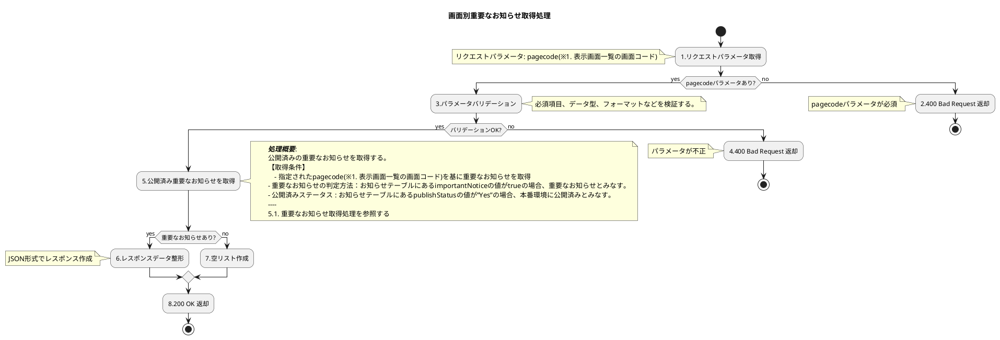

# API仕様書_AMGBIO507_【Liferay】重要なお知らせ取得業務API

## 1. 表紙

<h1 style="text-align:center;">

    ネット投票システム(RAISE)／API仕様書
    重要なお知らせ取得業務API

</h1>

<h3 style="text-align:center;">

    2026年05月29日
    第 01.00 版
    オッズ・パーク株式会社

</h3>

## 2. 変更履歴

| 版数  | 変更日         | 変更ID | 変更箇所 | 変更内容                     | 更新者       | 承認日付       | 承認者          |
| ----- | -------------- | :----- | -------- | ---------------------------- | ------------ | -------------- | --------------- |
| 00.01 | 2026年03月04日 | -      | -        | 新規作成                     | FPT DuyDV36  | -              | -               |
| 00.02 | 2026年03月09日 | -      | -        | 内部レビュー対応             | FPT DuyDV36  | 2026年03月09日 | FPT DatNT201    |
| 00.03 | 2026年03月11日 | -      | -        | SAレビュー指摘対応           | FPT DuyDV36  | 2026年03月12日 | FPT KazumasaN1 |
| 00.04 | 2026年03月24日 | -      | -        | OP様１回目レビューの指摘対応 | FPT DuyDV36  | 2026年03月24日 | FPT VuTH17      |
| 00.05 | 2026年04月02日 | -      | -        | OP様２回目レビューの指摘対応 | FPT DatNT201 | 2026年04月02日 | FPT VuTH17      |
| 01.00 | 2026年05月29日 | - | - | ベースライン版発行 | FPT HaNS5 | 2026年05月29日 | OP 川和田 |

## 3. インプット一覧

| ドキュメント | 詳細                 | ID/No                             | 名称                                                                                 |
| ------------ | -------------------- | --------------------------------- | ------------------------------------------------------------------------------------ |
| 要件定義書   | 業務フロー           | A03-050101-01                     | A03-050101-01_情報提供（CMS）_お知らせ情報登録_v01.01.xlsx                           |
| 要件定義書   | ビジネスルール       | 8-13.お知らせ                     | OP NEXTシステム_ビジネスルール_v02.05.xlsx                                           |
| 要件定義書   | 業務処理定義書       | A03-010_お知らせ記事登録・TOP表示 | A03_情報提供_業務処理定義書_v02.02.xlsx                                              |
| 要件定義書   | システム化業務一覧   | A03-031                           | システム化業務一覧_v02.08.xlsx                                                       |
| 要件定義書   | システム化業務説明書 | A03-031                           | システム化業務説明書_情報提供_A03-031_v01.01.xlsx                                    |
| その他       | 業務開発対象一覧     | -                                 | 業務開発対象一覧_お知らせ関連.xlsx                                                   |
| 新要件一覧   | -                    | No.291                            | 別紙090_新要件一覧.xlsx                                                              |
| 現行サイト   | -                    | -                                 | https://www.oddspark.com/info                                                        |
| モックアップ | -                    | -                                 | https://mockup.opnextlab.click/proto-pages/info/cm_ann_list                          |
| バックログ   | -                    | NEXTDEV-7981                      | 【情報系ーお知らせ関連】【課題】お知らせ関連のソリューション変更内容についてのご報告 |
| バックログ   | -                    | NEXTDEV-4283                      | 「通常お知らせ」の設定の「アプリ」の選択・制御の仕様検討                             |
| バックログ   | -                    | NEXTDEV-4284                      | お知らせ関連の追加依頼のロジックを検討・モック確認・資料更新                         |

## 4. API処理仕様

| APIID     | API 名                    |
| :-------- | :------------------------ |
| AMGBIO507 | 重要なお知らせ取得業務API |

### 4.1. API概要

#### 4.1.1. 目的

各画面（※1. 表示画面一覧）に表示するために、優先順位ルールに従い、本番環境公開済みの重要なお知らせ上位3件を取得する。

#### 4.1.2. 機能概要

* 優先順位ルールに従い、本番環境公開済みの重要なお知らせ上位3件を取得する。
* 重要なお知らせには「タイトル」「本文」が含まれる。
* 重要なお知らせの判定方法：お知らせテーブルにある重要なお知らせの値がtrueの場合、重要なお知らせとみなす。
* ログイン状態による表示制御（ログイン前・ログイン後・ログイン前後の絞り込み）はAPI呼出側の責務とする。

#### 4.1.3. データ構造

* **タイトル**: 重要なお知らせのタイトル
* **本文**: 重要なお知らせの本文
* **公開開始日時**: 重要なお知らせの公開開始日時
* **非公開日時**: 重要なお知らせの非公開日時
* **ログイン前後の表示設定**: 重要なお知らせの表示設定
* **表示画面一覧**: 重要なお知らせを表示する画面一覧
* **表示画面一覧:** 重要なお知らせの優先順位設定情報

#### 4.1.4. 制約や注意点

* **固定件数**: 取得件数は最大3件（ページネーションなし）。
* **公開ステータス**: **公開済み**の重要なお知らせのみ対象。※お知らせテーブルにあるステータスの値が”Yes”の場合、本番環境に公開済みとみなす。
* **必須パラメータ**: 画面コードパラメータは必須。未指定の場合は 400 Bad Request を返却する。
* **画面コード絞り込み**: 指定された画面コード（※1. 表示画面一覧の画面コード）をもとに、該当画面の重要なお知らせのみを取得する。

### 4.2. エンドポイント

| HTTPメソッド | リソースパス                                    |
| :----------- | :---------------------------------------------- |
| GET          | /o/headless-api/v1.0/cms-important-notification |

### 4.3. インプットパラメータ

| NO | 項目名     | 必須 | 備考                                                                                                                                                           |
| -- | :--------- | :--: | :------------------------------------------------------------------------------------------------------------------------------------------------------------- |
| 1  | 画面コード |  ○  | 種別：クエリストリング
データ型：数値
入力範囲：1～28
空文字・複数指定不可
項目ID（仮）：pagecode
※1. 表示画面一覧の画面コードを参照 |

**バリデーション:**

| No | 項目名     | チェック内容         | メッセージID | エラーメッセージ                     | HTTPステータス |
| -- | ---------- | -------------------- | ------------ | ------------------------------------ | -------------- |
| 1  | 画面コード | 未指定               | MDBCME0001   | 画面コードを入力してください。       | 400            |
| 2  | 画面コード | 存在しない画面コード | MDBCME0014   | 正しい画面コードを入力してください。 | 404            |

### 4.4. アウトプットパラメータ

| NO      | 項目名                                                           | 必須 | 備考                                                                                                                                              |
| ------- | ---------------------------------------------------------------- | :--: | ------------------------------------------------------------------------------------------------------------------------------------------------- |
| 1       | 重要なお知らせリスト                                             |  〇  | 重要なお知らせリスト
データ型：Array
項目ID（仮）：items                                                                                |
| 1.1     | &nbsp;&nbsp;&nbsp;お知らせID                                     |  〇  | 重要なお知らせID
データ型：Long
項目ID（仮）：id                                                                                        |
| 1.2     | &nbsp;&nbsp;&nbsp;タイトル                                       |  〇  | 重要なお知らせのタイトル
データ型：varchar(128)
最大文字数：128文字
項目ID（仮）：noticeTitle                                      |
| 1.3     | &nbsp;&nbsp;&nbsp;本文                                           |  〇  | 重要なお知らせの本文
データ型：varchar(255)
最大文字数：255文字
項目ID（仮）：noticeContent                                        |
| 1.4     | &nbsp;&nbsp;&nbsp;公開開始日時                                   |  〇  | 重要なお知らせの公開開始日時
データ型：Datetime
フォーマット：YYYY-MM-DD HH:MM:SS
項目ID（仮）：importantNoticeStart               |
| 1.5     | &nbsp;&nbsp;&nbsp;非公開日時                                     |  △  | 重要なお知らせの非公開日時
データ型：Datetime
フォーマット：YYYY-MM-DD HH:MM:SS
項目ID（仮）：importantNoticeEnd                   |
| 1.6     | &nbsp;&nbsp;&nbsp;ログイン前後の表示設定                         |  〇  | ログイン前後の表示設定
データ型：varchar(32)
最大文字数：32文字
項目ID（仮）：displayBeforeOrAfterLogin                            |
| 1.7     | &nbsp;&nbsp;&nbsp;表示画面一覧                                   |  〇  | 重要なお知らせを表示する画面一覧
データ型：Array
項目ID（仮）：displayPageMulti
対象画面コードに一致する表示画面情報のみ返却する。 |
| 1.7.1   | &nbsp;&nbsp;&nbsp;&nbsp;&nbsp;&nbsp;画面コード                   |  〇  | 重要なお知らせを表示する画面コード
データ型：Integer
項目ID（仮）：displayPageMulti.key                                                 |
| 1.7.2   | &nbsp;&nbsp;&nbsp;&nbsp;&nbsp;&nbsp;画面名                       |  〇  | 重要なお知らせを表示する画面名
データ型：varchar(32)
最大文字数：32文字
項目ID（仮）：displayPageMulti.name                        |
| 1.8     | &nbsp;&nbsp;&nbsp;先順位設定情報                                 |  〇  | 重要なお知らせの優先順位設定情報
データ型：Array
項目ID（仮）：priorities
対象画面コード に一致する表示画面情報のみ返却する。     |
| 1.8.1   | &nbsp;&nbsp;&nbsp;&nbsp;&nbsp;&nbsp;先順位設定お知らせID         |  〇  | 重要なお知らせの優先順位設定ID
データ型：Long
項目ID（仮）：priorities.key                                                              |
| 1.8.2   | &nbsp;&nbsp;&nbsp;&nbsp;&nbsp;&nbsp;優先順位設定画面一覧         |  〇  | 重要なお知らせの優先順位設定画面一覧
データ型：Array
項目ID（仮）：priorities.displayPageSingle                                         |
| 1.8.2.1 | &nbsp;&nbsp;&nbsp;&nbsp;&nbsp;&nbsp;&nbsp;&nbsp;&nbsp;画面コード |  〇  | 重要なお知らせの優先順位設定画面コード
データ型：Integer
項目ID（仮）：priorities.displayPageSingle.key                                 |
| 1.8.2.1 | &nbsp;&nbsp;&nbsp;&nbsp;&nbsp;&nbsp;&nbsp;&nbsp;&nbsp;画面名     |  〇  | 重要なお知らせの優先順位設定画面名
データ型：varchar(32)
最大文字数：32文字
項目ID（仮）：priorities.displayPageSingle.name        |
| 1.8.3   | &nbsp;&nbsp;&nbsp;&nbsp;&nbsp;&nbsp;優先順位                     |  〇  | 重要なお知らせの優先順位
データ型：Integer
項目ID（仮）：priorities.priority                                                            |
| 2       | 返却件数                                                         |  〇  | 返却件数
データ型：Integer
値範囲：0～3
項目ID（仮）：returnedCounde                                                               |
| 3       | メッセージ情報                                                   |  〇  | メッセージ情報（オブジェクト）
メッセージを返さない場合はnullを設定する                                                                      |
| 3.1     | &nbsp;&nbsp;&nbsp;メッセージID                                   |  △  | メッセージを一意に識別するID
データ型：文字列                                                                                                |
| 3.2     | &nbsp;&nbsp;&nbsp;メッセージ本文                                 |  △  | メッセージの内容
データ型：文字列                                                                                                            |

#### レスポンス例（競馬TOPの場合）

```json
{
  "items": [
    {
        "id": 1001,
        "noticeTitle": "お知らせ記事のタイトル01",
        "noticeContent": "お知らせ記事のコンテンツ01",
        "importantNoticeStart": "2026-01-14 21:00:00",
        "importantNoticeEnd": "2026-01-15 20:00:00",  
        "displayBeforeOrAfterLogin": "before",  
        "displayPageMulti": [
            {"key": 1,"name": "競馬TOP"}
        ],
        "priorities": [
            {
                "id": 1001,
                "displayPageSingle": [
                    {"key": 1,"name": "競馬TOP"}
                ],
                "priority": 1
            }
        ]
    },
    {
        "id": 1002,
        "noticeTitle": "お知らせ記事のタイトル02",
        "noticeContent": "お知らせ記事のコンテンツ02",
        "importantNoticeStart": "2026-01-14 21:00:00",
        "importantNoticeEnd": "2026-01-15 20:00:00",  
        "displayBeforeOrAfterLogin": "before",  
        "displayPageMulti": [
            {"key": 1,"name": "競馬TOP"}
        ],
        "priorities": [
            {
                "id": 1002,
                "displayPageSingle": [
                    {"key": "1","name": "競馬TOP"}
                ],
                "priority": 2
            }
        ]
    },
    {
        "id": 1003,
        "noticeTitle": "お知らせ記事のタイトル03",
        "noticeContent": "お知らせ記事のコンテンツ03",
        "importantNoticeStart": "2026-01-14 21:00:00",
        "importantNoticeEnd": "2026-01-15 20:00:00",  
        "displayBeforeOrAfterLogin": "before",  
        "displayPageMulti": [
            {"key": 1,"name": "競馬TOP"}
        ],
        "priorities": [
            {
                "id": 1003,
                "displayPageSingle": [
                    {"key": 1,"name": "競馬TOP"}
                ],
                "priority": 3
            }
        ]
    }
  ],
  "returnedCount": 3,
  "messageInfo": null
}
```

### 4.5. 処理フロー



### 4.6. エラーレスポンス

| HTTPステータス | 発生条件                 | メッセージID | メッセージ本文                                                     |
| :------------- | :----------------------- | :----------- | :----------------------------------------------------------------- |
| 400            | pagecodeパラメータ未指定 | MDBCME0001   | 画面コードを入力してください。                                     |
| 404            | 無効なpagecodeパラメータ | MDBCME0014   | 正しい画面コードを入力してください。                               |
| 500            | サーバー内部エラー       | MDBCME0012   | 一時的にアクセスできない状態です。時間を置いて再度お試しください。 |
| 503            | データベース接続エラー   | MDBCME0012   | 一時的にアクセスできない状態です。時間を置いて再度お試しください。 |

**エラーレスポンス例**

```json
{
  "messageInfo": {
    "messageId": "MDBCME0001",
    "messageBody": "画面コードを入力してください。"
  }
}
```

## 5. 項目転送仕様

### 5.1. 重要なお知らせ取得処理

**処理概要**
画面コードを基に、公開済みの最新3件の重要なお知らせを取得する。

**対象テーブル**

- お知らせテーブル
- 重要お知らせ優先度テーブル

**抽出条件**

- 重要お知らせ優先度テーブル.優先順位設定画面一覧.画面コード＝ 入力パラメータ.画面コード
- お知らせテーブル.重要なお知らせ ＝ true（重要なお知らせのみ取得する）
- お知らせテーブル.ステータス ＝ "Yes"（公開済みの重要なお知らせのみ取得する）
- 現在日時が お知らせテーブル.公開開始日時 以上 かつ お知らせテーブル.非公開日時以下、または お知らせテーブル.非公開日時が NULL（無期限公開）
  （公開期間外のお知らせは取得しない）
- 並び替えに使用する優先順位は、入力パラメータ.画面コードに一致する重要お知らせ優先度テーブルのレコードを用いる。

**結合条件**

- お知らせテーブル.お知らせID ＝ 重要お知らせ優先度テーブル.お知らせID

**結合種別**

- LEFT JOIN

**抽出件数**

- 取得単位はお知らせID単位とする。
- 指定された画面コード に対応する優先順位情報を用いて並び替えた後、お知らせID単位で重複を排除し、上位3件を取得する。

**重要なお知らせ表示順ルール**

1. 表示順は、指定されたpagecodeに対応する重要お知らせ優先度テーブルの優先順位を用いて、「1 → 2 → 3 → NULL」の順とする。
2. 優先順位がNULLのデータが複数存在する場合は、公開開始日時が現在日時に最も近いものを優先して表示する。

**件数制限**

- 重複排除後の結果から、3件まで取得する（LIMIT 3）。

#### 5.1.1. API項目転送仕様

|  順序  | 項目名                                                           | 型       | FROM/TO | 種別 | ID              | 名称     | 項目名                  | FROM/TO | 種別 | ID                          | 名称               | 項目名                          |
| :-----: | :--------------------------------------------------------------- | :------- | :-----: | ---- | --------------- | -------- | ----------------------- | ------- | ---- | --------------------------- | ------------------ | ------------------------------- |
|    1    | 画面コード                                                       | VAR      |   >>   | T    | m_notice_master | お知らせ | 表示画面一覧.画面コード | >>      | T    | m_important_notice_priority | 重要お知らせ優先度 | 優先順位設定画面一覧.画面コード |
|    2    | 重要なお知らせリスト                                             | Array    |   <<   | T    | m_notice_master | お知らせ | 重要なお知らせリスト    |         | T    | m_important_notice_priority | 重要お知らせ優先度 |                                 |
|   2.1   | &nbsp;&nbsp;&nbsp;お知らせID                                     | Long     |   <<   | T    | m_notice_master | お知らせ | お知らせID              | >>      | T    | m_important_notice_priority | 重要お知らせ優先度 | 先順位設定お知らせID            |
|   2.2   | &nbsp;&nbsp;&nbsp;タイトル                                       | Varchar  |   <<   | T    | m_notice_master | お知らせ | タイトル                |         | T    | m_important_notice_priority | 重要お知らせ優先度 |                                 |
|   2.3   | &nbsp;&nbsp;&nbsp;本文                                           | Varchar  |   <<   | T    | m_notice_master | お知らせ | 本文                    |         | T    | m_important_notice_priority | 重要お知らせ優先度 |                                 |
|   2.3   | &nbsp;&nbsp;&nbsp;公開開始日時                                   | Datetime |   <<   | T    | m_notice_master | お知らせ | 公開開始日時            |         | T    | m_important_notice_priority | 重要お知らせ優先度 |                                 |
|   2.5   | &nbsp;&nbsp;&nbsp;非公開日時                                     | Datetime |   <<   | T    | m_notice_master | お知らせ | 非公開日時              |         | T    | m_important_notice_priority | 重要お知らせ優先度 |                                 |
|   2.6   | &nbsp;&nbsp;&nbsp;ログイン前後の表示設定                         | Varchar  |   <<   | T    | m_notice_master | お知らせ | ログイン前後の表示設定  |         | T    | m_important_notice_priority | 重要お知らせ優先度 |                                 |
|   2.7   | &nbsp;&nbsp;&nbsp;表示画面一覧                                   | Array    |   <<   | T    | m_notice_master | お知らせ | 表示画面一覧            |         | T    | m_important_notice_priority | 重要お知らせ優先度 |                                 |
|  2.7.1  | &nbsp;&nbsp;&nbsp;&nbsp;&nbsp;&nbsp;画面コード                   | Long     |   <<   | T    | m_notice_master | お知らせ | 表示画面一覧.画面コード |         | T    | m_important_notice_priority | 重要お知らせ優先度 |                                 |
|  2.7.2  | &nbsp;&nbsp;&nbsp;&nbsp;&nbsp;&nbsp;画面名                       | Varchar  |   <<   | T    | m_notice_master | お知らせ | 表示画面一覧.画面名     |         | T    | m_important_notice_priority | 重要お知らせ優先度 |                                 |
|   2.8   | &nbsp;&nbsp;&nbsp;先順位設定情報                                 | Array    |   <<   | T    | m_notice_master | お知らせ |                         | <<      | T    | m_important_notice_priority | 重要お知らせ優先度 | 先順位設定情報                  |
|  2.8.1  | &nbsp;&nbsp;&nbsp;&nbsp;&nbsp;&nbsp;先順位設定お知らせID         | Long     |   <<   | T    | m_notice_master | お知らせ |                         | <<      | T    | m_important_notice_priority | 重要お知らせ優先度 | 先順位設定お知らせID            |
|  2.8.2  | &nbsp;&nbsp;&nbsp;&nbsp;&nbsp;&nbsp;優先順位設定画面一覧         | Array    |   <<   | T    | m_notice_master | お知らせ |                         | <<      | T    | m_important_notice_priority | 重要お知らせ優先度 | 優先順位設定画面一覧            |
| 2.8.2.1 | &nbsp;&nbsp;&nbsp;&nbsp;&nbsp;&nbsp;&nbsp;&nbsp;&nbsp;画面コード | Long     |   <<   | T    | m_notice_master | お知らせ |                         | <<      | T    | m_important_notice_priority | 重要お知らせ優先度 | 優先順位設定画面一覧.画面コード |
| 2.8.2.2 | &nbsp;&nbsp;&nbsp;&nbsp;&nbsp;&nbsp;&nbsp;&nbsp;&nbsp;画面名     | Array    |   <<   | T    | m_notice_master | お知らせ |                         | <<      | T    | m_important_notice_priority | 重要お知らせ優先度 | 優先順位設定画面一覧.画面名     |
|  2.8.3  | &nbsp;&nbsp;&nbsp;&nbsp;&nbsp;&nbsp;優先順位                     | Interger |   <<   | T    | m_notice_master | お知らせ |                         | <<      | T    | m_important_notice_priority | 重要お知らせ優先度 | 優先順位                        |
|    3    | 返却件数                                                         | Interger |   <<   | T    | m_notice_master | お知らせ | returnedCount(返却件数) |         | T    | m_important_notice_priority | 重要お知らせ優先度 |                                 |

## 6. 補足

**※1. 表示画面一覧**

重要なお知らせを表示する画面一覧について

| 業務コード名 | コード | コード値名                   |
| ------------ | ------ | ---------------------------- |
| 画面コード   | 1      | 総合　TOP画面                |
| 画面コード   | 2      | アプリ                       |
| 画面コード   | 3      | 競馬　TOP画面                |
| 画面コード   | 4      | 競馬　レース一覧             |
| 画面コード   | 5      | 競馬　レース情報             |
| 画面コード   | 6      | 競馬　予想情報               |
| 画面コード   | 7      | 競馬　オッズ一覧             |
| 画面コード   | 8      | 競馬　レース映像             |
| 画面コード   | 9      | 競馬　支払い結果一覧         |
| 画面コード   | 10     | 競輪　TOP画面                |
| 画面コード   | 11     | 競輪　レース一覧             |
| 画面コード   | 12     | 競輪　レース情報             |
| 画面コード   | 13     | 競輪　予想情報               |
| 画面コード   | 14     | 競輪　オッズ一覧             |
| 画面コード   | 15     | 競輪　レース映像             |
| 画面コード   | 16     | 競輪　支払い結果一覧         |
| 画面コード   | 17     | オートレース　TOP画面        |
| 画面コード   | 18     | オートレース　レース一覧     |
| 画面コード   | 19     | オートレース　レース情報     |
| 画面コード   | 20     | オートレース　予想情報       |
| 画面コード   | 21     | オートレース　オッズ一覧     |
| 画面コード   | 22     | オートレース　レース映像     |
| 画面コード   | 23     | オートレース　支払い結果一覧 |
| 画面コード   | 24     | LOTO　TOP画面                |
| 画面コード   | 25     | LOTO　レース一覧             |
| 画面コード   | 26     | LOTO　レース情報             |
| 画面コード   | 27     | LOTO　予想情報               |
| 画面コード   | 28     | LOTO　経過・結果             |

 