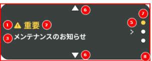

# Đặc Tả Component (Component Specification) - CDBIO0004 - [Nội Dung CMS] Thông Báo Quan Trọng

---

# 1. Trang Bìa

# Hệ Thống Bỏ Phiếu Qua Mạng (RAISE) / Tài Liệu Đặc Tả Component (Component Specification)

## Thông Báo Quan Trọng

**Ngày 29 tháng 05 năm 2026**
**Phiên Bản 01.00**

**Công Ty Cổ Phần Odds Park**

---

# 2. Lịch Sử Thay Đổi

| Phiên Bản | Ngày Thay Đổi | ID Thay Đổi | Vị Trí Thay Đổi | Nội Dung Thay Đổi | Người Cập Nhật | Ngày Phê Duyệt | Người Phê Duyệt |
|-----------|---------------|-------------|-----------------|-------------------|----------------|----------------|-----------------|
|00.01|14/01/2026|-|-|Tạo mới|FPT DatNT201|-|-|
|00.02|05/03/2025|-|-|Xử lý phản hồi từ Cross Review (Đánh giá chéo)|FPT DatNT201|06/03/2025|FPT DuyDV36|
|00.03|09/03/2025|-|-|Xử lý phản hồi từ SA Review (Đánh giá Kiến trúc hệ thống) của CMS|FPT DatNT201|09/03/2025|FPT KienBT1|
|00.04|11/03/2025|-|-|Xử lý phản hồi từ SA Review (Đánh giá Kiến trúc hệ thống)|FPT DatNT201|11/03/2025|FPT 朱|
|00.05|20/03/2025|-|-|Xử lý phản hồi từ lần Review (Đánh giá) đầu tiên của OP|FPT DatNT201|20/03/2025|FPT VuTH17|
|01.00|29/05/2026|-|-|Phát hành phiên bản Baseline (Cơ sở)|FPT HaNS5|29/05/2026|OP 川和田|

---

# 3. Danh Sách Tài Liệu Đầu Vào (Input)

| Loại Tài Liệu | Chi Tiết | ID / Số | Tên Tài Liệu |
|---------------|----------|---------|--------------|
|Tài liệu định nghĩa yêu cầu|Business Flow (Luồng nghiệp vụ)|A03-050101-01|A03-050101-01_情報提供（CMS）_お知らせ情報登録_v01.01.xlsx|
|Tài liệu định nghĩa yêu cầu|Business Rule (Quy tắc nghiệp vụ)|8-13. Thông báo|OP NEXTシステム_ビジネスルール_v02.05.xlsx|
|Tài liệu định nghĩa yêu cầu|Tài liệu định nghĩa xử lý nghiệp vụ|A03-010_Đăng ký bài viết thông báo・Hiển thị TOP|A03_情報提供_業務処理定義書_v02.02.xlsx|
|Tài liệu định nghĩa yêu cầu|Danh sách nghiệp vụ được hệ thống hóa|A03-031|システム化業務一覧_v02.08.xlsx|
|Tài liệu định nghĩa yêu cầu|Tài liệu mô tả nghiệp vụ được hệ thống hóa|A03-031|システム化業務説明書_情報提供_A03-031_v01.01.xlsx|
|Tài liệu khác|Danh sách đối tượng phát triển nghiệp vụ|-|業務開発対象一覧_お知らせ関連.xlsx|
|Danh sách yêu cầu mới|-|No.291|別紙090_新要件一覧.xlsx|
|Site hiện tại|-|-|https://www.oddspark.com/info|
|Mockup (Mẫu thiết kế giao diện)|-|-|https://mockup.opnextlab.click/proto-pages/info/cm_ann_list https://mockup.opnextlab.click/proto-pages/info/cm_ann_dtl https://mockup.opnextlab.click/proto-pages/common/cm_top?hasImportantNotice=true|
|Backlog (Danh sách công việc)|-|NEXTDEV-7981|[Hệ thống thông tin - Liên quan thông báo] [Vấn đề] Báo cáo về nội dung thay đổi giải pháp liên quan đến thông báo|
|Backlog (Danh sách công việc)|-|NEXTDEV-4283|Nghiên cứu thông số kỹ thuật về việc chọn và kiểm soát "App" trong cài đặt "Thông báo thông thường"|
|Backlog (Danh sách công việc)|-|NEXTDEV-4284|Nghiên cứu logic yêu cầu bổ sung liên quan đến thông báo, xác nhận Mockup, cập nhật tài liệu|

---

# 4. Cài Đặt Màn Hình Quản Trị Liferay

## 4.1 Layout (Bố Cục) Màn Hình

(Hình ảnh màn hình)

---

## 4.2 Mô Tả Các Trường

| STT | Tên Trường (Nghiệp Vụ) | Loại | Bắt Buộc | Chức Năng Chuẩn | Ghi Chú |
|-----|------------------------|------|----------|-----------------|---------|
|1|Label (Nhãn)|Text (Văn bản)|〇|-|Có thể chỉnh sửa Label của component thông báo quan trọng. Giá trị mặc định: "重要" (Quan trọng)|
|2|Màu Label (Nhãn)|Chọn màu|〇|-|Có thể chọn màu cho Label của component thông báo quan trọng. Giá trị mặc định: #FFD447|
|3|Màu Tiêu Đề|Chọn màu|〇|-|Đặt màu cho tiêu đề thông báo. Giá trị mặc định: #FFFFFF|
|4|Màu Nội Dung|Chọn màu|〇|-|Đặt màu cho nội dung chính của thông báo. Giá trị mặc định: #FFFFFF|
|5|Màu Nền (Background Color)|Chọn màu|〇|-|Đặt màu nền cho component thông báo quan trọng. Giá trị mặc định: #3A403E|

---

# 5. Hiển Thị Frontend (Giao Diện Người Dùng)

## 5.1 Layout (Bố Cục) Màn Hình

### 5.1.1 Desktop (Máy Tính)

Tham chiếu: Thông Báo Quan Trọng

### 5.1.2 Mobile (Điện Thoại Di Động)

Tham chiếu: Thông Báo Quan Trọng

### 5.1.3 Trường Hợp Có Từ 2 Bản Tin Trở Lên

---

## 5.2 Mô Tả Các Trường

| STT | Tên Trường | Sự Kiện (Event) | Nội Dung Sự Kiện | Nguồn Dữ Liệu | Ghi Chú |
|-----|------------|-----------------|------------------|---------------|---------|
|1|Icon (Biểu tượng) Cảnh Báo|Đọc (Read)|Hiển thị biểu tượng đánh dấu thông báo quan trọng.|Hardcode (Mã cứng)|N/A|
|2|Label (Nhãn) "Quan Trọng"|Đọc (Read)|Hiển thị tiêu đề của thông báo quan trọng. Mã màu: #FFD447|CMS|Lấy Label từ mục 4.2 STT 1 và áp dụng màu Label từ STT 2.|
|3|Tiêu Đề (Title)|Đọc (Read)|Hiển thị tiêu đề thông báo.|CMS|Lấy tiêu đề từ "Quản lý thông báo" trên CMS.|
|4|Nội Dung (Body)|Đọc (Read)|Hiển thị nội dung thông báo khoảng 100 ký tự. Không hiển thị khi có từ 2 thông báo quan trọng trở lên.|CMS|Lấy nội dung bài viết từ CMS.|
|5|Icon (Biểu tượng) Chuyển Trang|Đọc (Read)|Hiển thị biểu tượng chỉ hướng chuyển sang màn hình chi tiết thông báo.|Hardcode (Mã cứng)|N/A|
|6|Nút Mũi Tên Lên/Xuống (▲▼)|Click (Nhấp chuột)|Chỉ hiển thị khi có từ 2 thông báo quan trọng trở lên. Nhấn nút lên/xuống để chuyển qua bài viết trước/sau theo dạng Loop (vòng lặp). Tự động chuyển sau mỗi 5 giây. Dừng khi Hover (di chuột qua), tiếp tục khi chuột rời đi (Mouse Out).|Hardcode (Mã cứng)|N/A|
|7|Carousel Indicator (Chỉ báo băng chuyền)|Đọc (Read)|Hiển thị thứ tự thông báo đang được hiển thị. Indicator được Click (nhấp) sẽ chuyển sang màu vàng.|CMS|N/A|
|8|Toàn Bộ Component|Click (Nhấp chuột)|Click vào toàn bộ component bao gồm cả phần trống (ngoại trừ STT 6, 7) sẽ chuyển sang màn hình chi tiết thông báo. Tham số chuyển trang: [Quản lý thông báo].[ID bài viết]|Hardcode (Mã cứng)|N/A|

---

### Nguồn Dữ Liệu Các Trường

| STT | Tên Trường | Tên Object CMS | ID Object CMS | Tên Trường Lấy Dữ Liệu | ID Trường Lấy Dữ Liệu |
|-----|------------|----------------|---------------|------------------------|----------------------|
|3|Tiêu Đề (Title)|Quản lý thông báo|m_notice_master|Tiêu đề thông báo|noticeTitle|
|4|Nội Dung (Body)|Quản lý thông báo|m_notice_master|Nội dung thông báo|noticeContent|
|7|Carousel Indicator (Chỉ báo băng chuyền)|Độ ưu tiên thông báo quan trọng|m_important_notice_priority|Độ ưu tiên (Priority)|priority|

---

# 6. Bổ Sung

Không có.
